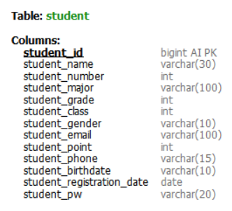
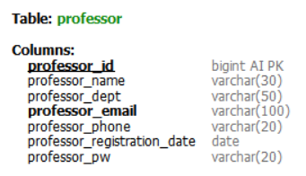
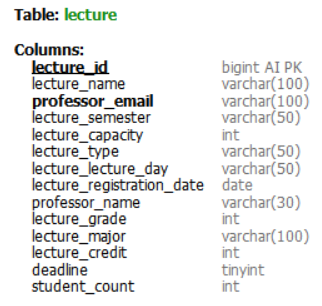
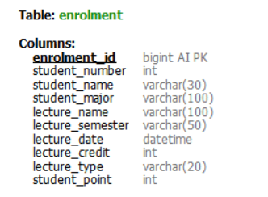
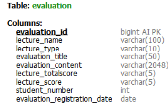
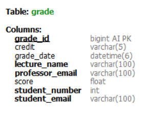
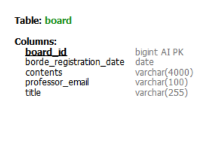

# 🏫 유한대학교 SpringBoot 기말프로젝트
**유한대학교 컴퓨터소프트웨어공학과 3학년 1학기 스프링부트 기말고사 프로젝트입니다.**

## 📋 주제
<h3>프로젝트의 주제는 <em style="display: inline; color: green;">학교포털 웹사이트</em>입니다.</h3>

### 기존 사이트와 다른 점
```texture
 기존 학교 포털시스템의 수강신청시스템은 전공은 선착순이 아니지만
교양은 선착순이므로 나에게 정말 필요한 강의지만 피치 못할 개인사정으로 인해
빠른수강신청을 하지 못할 경우 원하는 강의를 수강하지 못하게 됩니다.

 이런 상황을 조금이라도 줄이고자 교양 수강신청 시스템에 포인트 배팅 제도를 도입했습니다.
포인트 점수에 따라 개개인 별로 해당 강의에 대한 중요도가 나타나므로 좀 더 해당 강의가 필요한 학생이 들을 수 있게 됩니다. 

 교양수강신청에서 포인트 순위가 수강정원에 들지 못해 해당과목 수강신청 마감 후에
자동취소가 된다면 추가 수강신청에서 마감되지 않은 강의를 수강신청할 수 있습니다.
```
_~~동일포인트점수일 경우에는 선착순 입니다. 그렇기 때문에 초기 포인트를 적절하게 부여해야합니다.~~_
## 👨‍💻🧑‍💻 Developers
- <h2>👨‍💻 임성준</h2>

	- 프로젝트 기획
	- DB 설계
	- 회원관리 기능 구현
		- 학생 / 교수(관리자) 회원가입
		- 로그인 / 로그아웃
		- 회원 세션 처리
	- 강의관리 기능 구현
		- 강의 등록
		- 개설강의목록 조회
	- 수강신청 기능 구현
		- 개설강의목록 조회 및 검색기능
		- 전공수강신청
		- 교양수강신청
		- 추가수강신청
		- 수강신청목록 조회 및 검색기능
		- 수강신청취소
		- 수강신청 마감기능
	- 강의평가 기능 구현
		- 강의평가목록 조회 및 검색기능
		- 강의평가 등록
		
- <h2>🧑‍💻 이정민</h2>

	- 회원관리 기능 구현
		- 학번생성기능
	- 성적관리 기능 구현
		- 성적등록
		- 성적수정
		- 성적조회
	- 게시판관리 기능 구현
		- 글 등록
		- 글 수정
		- 글 삭제
		- 글 조회
## 💻 개발환경 및 기술스택
<h4>개발환경</h4>
<div>
	
    
</div>

<h4>FrontEnd</h4>
<div>
	
	
	
</div>

<h4>BackEnd</h4>
<div>
	
	
</div>

## 화면구성

## 테이블 구조
### Student - 학생테이블

### Professor - 교수테이블

### Lecture - 강의테이블

### Enrolment - 수강신청테이블

### Evaluation - 강의평가테이블

### Grade - 성적테이블

### Board - 게시판테이블


## 기능설명
### 회원관리 기능(학생 / 교수)
- 학번생성
```java
// 학번생성기능
private void generateStudentNumber(Student student) {
	// 현재 연도 가져오기
	int currentYear = LocalDate.now().getYear();

	// 전공에 따라 학번 생성
	String studentMajor = student.getStudentMajor();
	int sequence = studentRepository.countByStudentMajor(studentMajor) + 1;
	String studentNumberStr = String.format("%d%s%03d", currentYear, getPrefixForMajor(studentMajor), sequence);
	
	// String을 Integer로 변환
	Integer studentNumber = Integer.parseInt(studentNumberStr);
	student.setStudentNumber(studentNumber);
}

private String getPrefixForMajor(String studentMajor) {
	// 각 전공에 따른 학번 접두사 설정
	if ("컴퓨터소프트웨어공학".equals(studentMajor)) {
		return "07";
	} else if ("전자공학".equals(studentMajor)) {
		return "08";
	} else if ("경영학".equals(studentMajor)) {
		return "09";
	} else {
		throw new IllegalArgumentException("지원되지 않는 전공입니다.");
	}
}
```
- 학생등록
```java
// 학생등록기능
@PostMapping("/register")
public String registerStudent(@ModelAttribute Student student) {
	try {
		studentService.registerStudent(student);
		return "redirect:/";
	} catch (Exception e) {
		// 등록된 학번이 없을 경우 예외 처리
		throw new StudentNotFoundException("Error : " + e.getMessage());
	}
}
```
```java
// 학생등록
public Student registerStudent(Student student) {
	generateStudentNumber(student);
	// 만약 학번이 이미 등록되어 있을 경우
	if (studentRepository.existsByStudentNumber(student.getStudentNumber())) {
		throw new AlreadyExistsStudentException("이미 존재하는 학번입니다.");
	}
	
	/** 
	 * 교수가 학생 등록할 때 학생 개인정보는 등록하지 않음
	 * 그래서 해당 컬럼들을 기본값으로 DB에 등록
	 **/
	if (student.getStudentName() == null) student.setStudentName("");
	if (student.getStudentEmail() == null) student.setStudentEmail("");
	if (student.getStudentPw() == null) student.setStudentPw("");
	if (student.getStudentBirthdate() == null) student.setStudentBirthdate("");
	if (student.getStudentPhone() == null) student.setStudentPhone("");
	if (student.getStudentPoint() == null) student.setStudentPoint(15);
	if (student.getStudentGender() == null) student.setStudentGender("");
	if (student.getStudentRegistrationDate() == null) student.setStudentRegistrationDate(LocalDate.now());
	studentRepository.updateAutoIncrementValue();
	return studentRepository.save(student);
}
```
- 회원가입
```java
// 학생회원가입 기능
@PostMapping("/update")
public String updateStudent(@ModelAttribute Student student) {
	try {
		// 교수가 먼저 등록한 기본정보에서 추가로 회원개인정보를 등록. 즉, UPDATE
		studentService.updateStudent(student);
		return "redirect:/";
	} catch (Exception e) {
		throw new StudentNotFoundException("등록되어 있지 않은 학번입니다.");
	}
}
```
```java
// 학생 회원정보 UPDATE로 최종회원가입
public Student updateStudent(Student student) {
	Optional<Student> existingStudentOpt = studentRepository.findByStudentNumberAndStudentMajor(
			student.getStudentNumber(), student.getStudentMajor());

	// 등록된 학생이 존재할 경우
	if (existingStudentOpt.isPresent()) {
		Student existingStudent = existingStudentOpt.get();
		existingStudent.setStudentName(student.getStudentName());
		existingStudent.setStudentGender(student.getStudentGender());
		existingStudent.setStudentEmail(student.getStudentEmail());
		existingStudent.setStudentPw(student.getStudentPw());
		existingStudent.setStudentPhone(student.getStudentPhone());
		existingStudent.setStudentBirthdate(student.getStudentBirthdate());
		existingStudent.setStudentRegistrationDate(LocalDate.now());
		return studentRepository.save(existingStudent);
	} else {
		throw new StudentNotFoundException("학번을 찾을 수 없습니다. " + student.getStudentNumber());
	}
}
```

- 로그인 / 로그아웃
```java
// 학생 로그인 기능 & 세션처리
@PostMapping("/login")
public String login(
		@ModelAttribute("student") Student student,
		BindingResult bindingResult,
		Model model,
		HttpSession session) {
	if (bindingResult.hasErrors()) throw new StudentNotFoundException("유효성 검사 오류 발생");
	try {
		boolean loginSuccess = studentService.login(student.getStudentEmail(), student.getStudentPw());
		if (loginSuccess) {
			System.out.println(student + " " + student.getStudentEmail()); // TEST
			String studentEmail = (String) student.getStudentEmail();
			String studentName = studentService.findBystudentName(studentEmail);
			// 로그인 성공 시 세션에 저장               
			session.setAttribute("loggedInStudent", student);
			session.setAttribute("loggedInStudentEmail", student.getStudentEmail());
			session.setAttribute("loggedInStudentName", studentName);
			session.setAttribute("loggedInStudentNumber", student.getStudentNumber());
			return "redirect:/";
		} else {
			// 이 부분은 도달하지 않음, 예외가 발생할 것이기 때문
			throw new StudentNotFoundException("이메일 또는 비밀번호가 잘못되었습니다.");
		}
	} catch (StudentNotFoundException e) {
		throw new StudentNotFoundException("이메일 또는 비밀번호가 잘못되었습니다.");
	}
}

// 로그아웃 기능
@GetMapping("/logout")
public String logout(HttpSession session) {
	session.invalidate(); // 세션 무효화
	return "redirect:/"; // 홈 페이지 또는 로그아웃 후 이동할 페이지로 리다이렉트
}
```
```java
public boolean login(String email, String password) throws StudentNotFoundException {
	// 이메일을 통해 학생 정보 가져오기
	Optional<Student> studentOptional = studentRepository.findByStudentEmail(email);
	
	// 학생 정보가 없거나 비밀번호가 일치하지 않으면 로그인 실패
	if (studentOptional.isEmpty() || !studentOptional.get().getStudentPw().equals(password)) {
		throw new StudentNotFoundException("이메일 또는 비밀번호가 잘못되었습니다. " + studentOptional);
	}
	return true; // 로그인 성공
}
```

```java
// 교수 로그인
@PostMapping("/login")
public String login(@ModelAttribute("professor") Professor professor,
					BindingResult bindingResult,
					Model model,
					HttpSession session) {
	if (bindingResult.hasErrors()) throw new ProfessorLoginException("유효성 검사 오류 발생");
	
	// 입력받은 교수 이메일과 교수 패스워드값 확인
	System.out.println(professor.getProfessorEmail() + " " + professor.getProfessorPw());
	try {
		boolean loginSuccess = professorService.login(professor.getProfessorEmail(), professor.getProfessorPw());
		if (loginSuccess) {
			// 로그인 성공 시 다음 페이지로 리다이렉트 또는 모델에 추가 정보 전달 가능
			System.out.println("이메일 : " + professor.getProfessorEmail());
			
			String professorEmail = (String) professor.getProfessorEmail();
			String professorName = professorService.findByProfessorName(professorEmail);
			System.out.println("이름 : " + professorName);
			
			// 세션에 저장
			session.setAttribute("loggedInProfessor", professor);
			session.setAttribute("loggedInProfessorEmail", professor.getProfessorEmail());
			session.setAttribute("loggedInProfessorName", professorName);
			return "redirect:/";
		} else {
			// 이 부분은 도달하지 않음, 예외가 발생할 것이기 때문
			throw new ProfessorLoginException("이메일 또는 패스워드가 잘못되었습니다.");
		}
	} catch (ProfessorLoginException e) {
		throw new ProfessorLoginException("이메일 또는 패스워드가 잘못되었습니다.2");
	}
}

// 로그아웃
@GetMapping("/logout")
public String logout(HttpSession session) {
	session.invalidate(); // 세션 무효화
	return "redirect:/"; // 홈 페이지 또는 로그아웃 후 이동할 페이지로 리다이렉트
}
```
```java
// 교수 로그인
public boolean login(String email, String password) throws ProfessorLoginException {
	// 이메일을 통해 교수 정보 가져오기
	Optional<Professor> professorOptional = professorRepository.findByProfessorEmail(email);
	System.out.println("professorOptional의 값 : " + professorOptional.get().getProfessorName());
	// 교수 정보가 없거나 비밀번호가 일치하지 않으면 로그인 실패
	if (professorOptional.isEmpty() || !professorOptional.get().getProfessorPw().equals(password)) {
		throw new ProfessorLoginException("이메일 또는 패스워드가 잘못되었습니다. " + professorOptional);
	}
	// 로그인 성공
	return true;
}
```
### 강의관리 기능
- 강의등록
```java
// 강의 등록
@PostMapping("/register")
public String registerLecture(@ModelAttribute Lecture lecture) {
	lectureService.registerLecture(lecture);
	System.out.println(lecture);
	try {
		lectureService.registerLecture(lecture);
		System.out.println(lecture);
		return "redirect:/";
	} catch (Exception e) {
		return "redirect:/error";
	}
}
```
```java
// 강의 등록
public Lecture registerLecture(Lecture lecture) {
	lecture.setLectureRegistrationDate(LocalDate.now()); // 등록날짜는 현재날짜
	lectureRepository.updateAutoIncrementValue();
	return lectureRepository.save(lecture);
}
```
```java
@Modifying
@Transactional
@Query(value = "ALTER TABLE Lecture AUTO_INCREMENT = 1", nativeQuery = true)
void updateAutoIncrementValue();
```
### 수강신청 기능
- 개설강의 검색기능
```java
// 강의검색 기능
@PostMapping("/search")
public String searchLectures(
		@ModelAttribute Lecture lecture,
		Model model) {
	List<Lecture> lectures = lectureService.findBySearchEnrolmentLecture(lecture);
	model.addAttribute("lectures", lectures);
	return "student/enrolment/lectureResults :: lectureResultsFragment"; // 검색 결과를 보여줄 템플릿 이름과 fragment 지정
}
```
- 수강신청현황 검색기능
```java
// 수강신청현황 검색기능
@PostMapping("/enrolmentList/search")
public String searchEnrolments(
		@ModelAttribute Enrolment enrolment,
		@SessionAttribute("loggedInStudentEmail") String studentEmail,
		Model model,
		HttpSession session) {
	System.out.println("입력받은 값 : " + enrolment.getStudentNumber());
	System.out.println("입력받은 값 : " + enrolment.getLectureSemester());
	Optional<Student> studentInfo = studentService.findByEnrolmentStudentInfo(studentEmail);
	
	Student student = studentInfo.orElseThrow(() 
			-> new StudentNotFoundException("학생 정보를 찾을 수 없습니다: " + studentEmail));;
			
	System.out.println(student.getStudentNumber());
	int myStudentNumber = student.getStudentNumber();
	List<Enrolment> enrolments = enrolmentService.findByMyEnrolment(myStudentNumber);
	model.addAttribute("enrolments", enrolments);
	return "student/enrolment/enrolmentResults :: enrolmentResultsFragment"; // 검색 결과를 보여줄 템플릿 이름과 fragment 지정
}
```
- 수강신청취소
```java
// 수강신청 취소
@PostMapping("/delete/{id}")
public String deleteEnrolment(@PathVariable Long id, RedirectAttributes redirectAttributes) {
	enrolmentService.deleteEnrolment(id);
	redirectAttributes.addFlashAttribute("message", "수강신청이 취소되었습니다.");
	return "redirect:/";
}
```
- 전공수강신청
```java
@GetMapping("/major/register")
public String registerMajorEnrolment(
		@ModelAttribute Lecture lecture,
		@RequestParam int lectureId,
		@RequestParam("lectureName") String lectureName,
		@RequestParam("lectureMajor") String lectureMajor,
		@SessionAttribute("loggedInStudentEmail") String studentEmail,
		Model model,
		HttpSession session) {
	/* TODO
		* 전공수강신청페이지에서 입력한 학과명을 세션으로 저장
		* 해당 데이터로 강의테이블에서 lecture_major명이 현재 세션강의명과 일치하는 값을 찾기
		*/
	// 세션에 저장한 학과명과 학년을 확인
	System.out.println("입력받은 학과명 : " + session.getAttribute("inputLectureMajorSession"));
	System.out.println("입력받은 학년 : " + session.getAttribute("inputLectureGradeSession"));
	System.out.println("입력받은 분류 : " + session.getAttribute("inputLectureTypeSession"));
	System.out.println(lectureId);
	
	String inputLectureMajorSession = (String) session.getAttribute("inputLectureMajorSession");
	int inputLectureGradeSession = (int) session.getAttribute("inputLectureGradeSession");
	String inputLectureTypeSession = (String) session.getAttribute("inputLectureTypeSession");
	
	// TODO : 강의ID 가져오기 성공. 강의ID의 값으로 get(0) 부분 수정하고 이어서 수강신청 테이블에 저장할 데이터 정리 후 저장
	// 학생 메일로 수강신청에 필요한 학생정보 가져오기
	List<Lecture> enrolmentLectureInfo = lectureService.findByLectureMajorAndLectureGrade(
			inputLectureMajorSession, inputLectureGradeSession, inputLectureTypeSession);		
	int enrolmentListSize = enrolmentLectureInfo.size();
	
	System.out.println("전공 enrolmentListSize " + enrolmentListSize);
	
	Optional<Student> studentOptional = studentService.findByEnrolmentStudentInfo(studentEmail);
	Student student = studentOptional.orElseThrow(() 
			-> new StudentNotFoundException("학생 정보를 찾을 수 없습니다: " + studentEmail));
	
	System.out.println("강의명 : " + lectureName);
	String studentMajor = student.getStudentMajor();
	try {
		Lecture selectedLecture = enrolmentLectureInfo.stream()
				.filter(l -> l.getLectureName().equals(lectureName))
				.findFirst()
				.orElseThrow(() -> new IllegalArgumentException("유효하지 않은 강의명: " + lectureName));
		
		LocalDateTime currentDate = LocalDateTime.now();
		Enrolment enrolmentMajor = new Enrolment(
				null,  // majorEnrolmentId는 자동 생성되므로 null로 설정합니다.
				student.getStudentNumber(),
				student.getStudentName(),
				studentMajor,
				0,
				lectureName,
				selectedLecture.getLectureSemester(),
				currentDate,  // 현재 날짜로 설정
				selectedLecture.getLectureCredit(),
				selectedLecture.getLectureType()
		);
		System.out.println("studentMajor : " + studentMajor);
		System.out.println("lectureMajor : " + lectureMajor);
		System.out.println(studentMajor == lectureMajor); // 값은 같지만 참조하는 객체가 다르기때문에 비교연산자로 비교할 시 값은 false

		if(studentMajor.equals(lectureMajor)) {
			enrolmentService.registerEnrolment(enrolmentMajor); // 수강신청 등록
			// TODO 등록한 강의의 student_count 값 증가시키기
			lectureService.updateLectureStudentCount(lectureName);
			return "redirect:/";
		}
		else {
			throw new MajorNotEqualException("당신의 전공과목이 아닙니다.");
		}
	} catch(Exception e) {
		throw new EnrolmentException(e.getMessage());
	}
}
```
- 교양수강신청
```java
// 교양 수강신청 기능
@PostMapping("/liberalArts/register")
public String registerLiberalArtsEnrolment(
		@RequestParam("lectureId") int lectureId,
		@RequestParam("lectureName") String lectureName,
		@RequestParam("bettingPoints") int bettingPoints,
		@SessionAttribute("loggedInStudentEmail") String studentEmail,
		Model model,
		HttpSession session) {
	// 세션 값 가져오기
	String inputLectureMajorSession = (String) session.getAttribute("inputLectureMajorSession");
	int inputLectureGradeSession = (int) session.getAttribute("inputLectureGradeSession");
	String inputLectureTypeSession = (String) session.getAttribute("inputLectureTypeSession");

	// 학생 메일로 수강신청에 필요한 학생정보 가져오기
	List<Lecture> enrolmentLectureInfo = lectureService.findByLectureMajorAndLectureGrade(
			inputLectureMajorSession, inputLectureGradeSession, inputLectureTypeSession);
	int enrolmentListSize = enrolmentLectureInfo.size();
	System.out.println("교양 enrolmentListSize " + enrolmentListSize);
	Optional<Student> studentOptional = studentService.findByEnrolmentStudentInfo(studentEmail);
	Student student = studentOptional.orElseThrow(() 
			-> new StudentNotFoundException("학생 정보를 찾을 수 없습니다: " + studentEmail));
	
	try {
		System.out.println("학생메일: " + studentEmail);
		System.out.println("학번: " + student.getStudentNumber());
		System.out.println("학생명: " + student.getStudentName());
		System.out.println("학과: " + student.getStudentMajor());
		System.out.println("강의포인트 : " + student.getStudentPoint());

		// 선택한 강의 정보 출력
		Lecture selectedLecture = enrolmentLectureInfo.stream()
				.filter(l -> l.getLectureName().equals(lectureName))
				.findFirst()
				.orElseThrow(() -> new IllegalArgumentException("유효하지 않은 강의명: " + lectureName));

		System.out.println("강의명 : " + selectedLecture.getLectureName());
		System.out.println("강의학기 : " + selectedLecture.getLectureSemester());
		System.out.println("강의등록일 : " + selectedLecture.getLectureRegistrationDate());
		System.out.println("강의학점 : " + selectedLecture.getLectureCredit());
		System.out.println("강의분류 : " + selectedLecture.getLectureType());
		System.out.println("강의ID : " + lectureId);
		System.out.println("배팅 포인트 : " + bettingPoints);

		LocalDateTime currentDate = LocalDateTime.now();

		// 교양 수강신청 정보 저장
		Enrolment enrolmentLiberalArt = new Enrolment(
				null,  // majorEnrolmentId는 자동 생성되므로 null로 설정합니다.
				student.getStudentNumber(),
				student.getStudentName(),
				student.getStudentMajor(),
				0, 
				selectedLecture.getLectureName(),
				selectedLecture.getLectureSemester(),
				currentDate,  // 현재 날짜로 설정
				selectedLecture.getLectureCredit(),
				selectedLecture.getLectureType()
		);
		System.out.println(student.getStudentPoint());
		if(student.getStudentPoint()-bettingPoints >= 0) {
			// 배팅 포인트 설정
			enrolmentLiberalArt.setStudentPoint(bettingPoints);
			student.setStudentPoint(student.getStudentPoint()-bettingPoints);
			enrolmentService.registerEnrolment(enrolmentLiberalArt);
		}
		else throw new StudentPointException("포인트가 부족합니다."); 
		
		// TODO 등록한 강의의 student_count 값 증가시키기
		lectureService.updateLectureStudentCount(lectureName);
		return "redirect:/"; // 성공적으로 수강신청 후 메인 페이지로 리다이렉트
	} catch (Exception e) {
		throw new StudentNotFoundException(e.getMessage());
	}
}
```
- 교양수강신청 마감기능
```java
// 교양 수강신청 마감 기능
@PostMapping("/professor/deadline")
public String deadlineRegistration(@RequestParam("lectureName") String lectureName, Enrolment enrolment) {
	lectureService.updateLectureDeadline(lectureName, 1); // deadline 값 1로 변경해서 수강신청 마감

	List<Enrolment> enrolmentStudentList = enrolmentService.findByEnrolmentStudentList(lectureName);
	List<Lecture> lectureList = lectureService.findByLectureName(lectureName);
	int lectureCapacity = lectureList.get(0).getLectureCapacity();
	
	System.out.println(lectureList.get(0).getLectureName());
	System.out.println("수강정원 : " + lectureList.get(0).getLectureCapacity());
	
	int enrolmentStudentListSize = enrolmentStudentList.size();
	enrolmentService.deleteStudent(lectureName, enrolmentStudentListSize, lectureCapacity);
	return "redirect:/";
}
```
- 추가수강신청
```java
// 추가수강신청 기능
@GetMapping("/secondEnrolment/register")
public String registerSecondEnrolment(
		@RequestParam("lectureId") int lectureId,
		@RequestParam("lectureName") String lectureName,
		@SessionAttribute("loggedInStudentEmail") String studentEmail,
		Model model,
		HttpSession session) {
	// 세션 값 가져오기
	String inputLectureMajorSession = (String) session.getAttribute("inputLectureMajorSession");
	int inputLectureGradeSession = (int) session.getAttribute("inputLectureGradeSession");
	String inputLectureTypeSession = (String) session.getAttribute("inputLectureTypeSession");

	// 학생 메일로 수강신청에 필요한 학생정보 가져오기
	List<Lecture> enrolmentLectureInfo = lectureService.findByLectureMajorAndLectureGrade(
			inputLectureMajorSession, inputLectureGradeSession, inputLectureTypeSession);
	int enrolmentListSize = enrolmentLectureInfo.size();
	System.out.println("교양 enrolmentListSize " + enrolmentListSize);
	Optional<Student> studentOptional = studentService.findByEnrolmentStudentInfo(studentEmail);
	Student student = studentOptional.orElseThrow(() 
			-> new StudentNotFoundException("학생 정보를 찾을 수 없습니다: " + studentEmail));
	
	try {
		System.out.println("학생메일: " + studentEmail);
		System.out.println("학번: " + student.getStudentNumber());
		System.out.println("학생명: " + student.getStudentName());
		System.out.println("학과: " + student.getStudentMajor());

		// 선택한 강의 정보 출력
		Lecture selectedLecture = enrolmentLectureInfo.stream()
				.filter(l -> l.getLectureName().equals(lectureName))
				.findFirst()
				.orElseThrow(() -> new IllegalArgumentException("유효하지 않은 강의명: " + lectureName));

		System.out.println("강의명 : " + selectedLecture.getLectureName());
		System.out.println("강의학기 : " + selectedLecture.getLectureSemester());
		System.out.println("강의등록일 : " + selectedLecture.getLectureRegistrationDate());
		System.out.println("강의학점 : " + selectedLecture.getLectureCredit());
		System.out.println("강의분류 : " + selectedLecture.getLectureType());
		System.out.println("강의ID : " + lectureId);

		LocalDateTime currentDate = LocalDateTime.now();

		// 추가 수강신청 정보 저장
		Enrolment enrolmentSecond = new Enrolment(
				null,  // majorEnrolmentId는 자동 생성되므로 null로 설정합니다.
				student.getStudentNumber(),
				student.getStudentName(),
				student.getStudentMajor(),
				0,
				selectedLecture.getLectureName(),
				selectedLecture.getLectureSemester(),
				currentDate,  // 현재 날짜로 설정
				selectedLecture.getLectureCredit(),
				selectedLecture.getLectureType()
		);

		enrolmentService.registerEnrolment(enrolmentSecond);
		// TODO 등록한 강의의 student_count 값 증가시키기
		lectureService.updateLectureStudentCount(lectureName);
		return "redirect:/"; // 성공적으로 수강신청 후 메인 페이지로 리다이렉트
	} catch (Exception e) {
		throw new StudentNotFoundException(e.getMessage());
	}
}
```

### 강의평가 기능
- 강의평가 등록
```java
// 학생 강의평가 등록
@PostMapping("/register")
public String updateEvaluation(Model model, Evaluation evaluation) {
	model.addAttribute("evaluation", new Evaluation());
	try {
		evaluationService.registerEvaluation(evaluation);
		return "redirect:/";
	} catch (Exception e) {
		throw new EvaluationNotFoundException("등록된 강의평가를 찾을 수 없습니다.");
	}
}
```
```java
// 강의평가 등록
public Evaluation registerEvaluation(Evaluation evaluation) {
	System.out.println(evaluation.getLectureName()); // 강의명 체크
	
	// 만약 학번이 이미 등록되어 있을 경우
	if (evaluationRepository.existsByEvaluationId(evaluation.getEvaluationId())) {
		throw new AlreadyExistsEvaluationException("해당 교과목의 강의 평가는 등록되어 있습니다.");
	}
	
	evaluation.setEvaluationRegistrationDate(LocalDate.now()); // 등록날짜는 현재날짜
	evaluationRepository.updateAutoIncrementValue();
	return evaluationRepository.save(evaluation);
}
```
- 강의평가 목록 검색기능
```java
// 교수 평가목록 검색기능
@PostMapping("/professor/search")
public String evaluationSearch(
		Model model,
		@RequestParam("lectureName") String lectureName,
		@ModelAttribute Evaluation evaluation) {
	List<Evaluation> evaluations = evaluationService.findByEvaluationList(lectureName);
	// TODO 교수명과 학과명으로 evaluation 테이블에서 데이터찾기
	model.addAttribute("evaluations", evaluations);
	// 검색 결과를 보여줄 템플릿 이름과 fragment 지정
	return "professor/lecture/evaluationListResults :: evaluationListResultsFragment";
}
```
### 성적관리 기능

### 게시판 기능
- 글 등록
- 글 수정
- 글 삭제

## 보완할 점